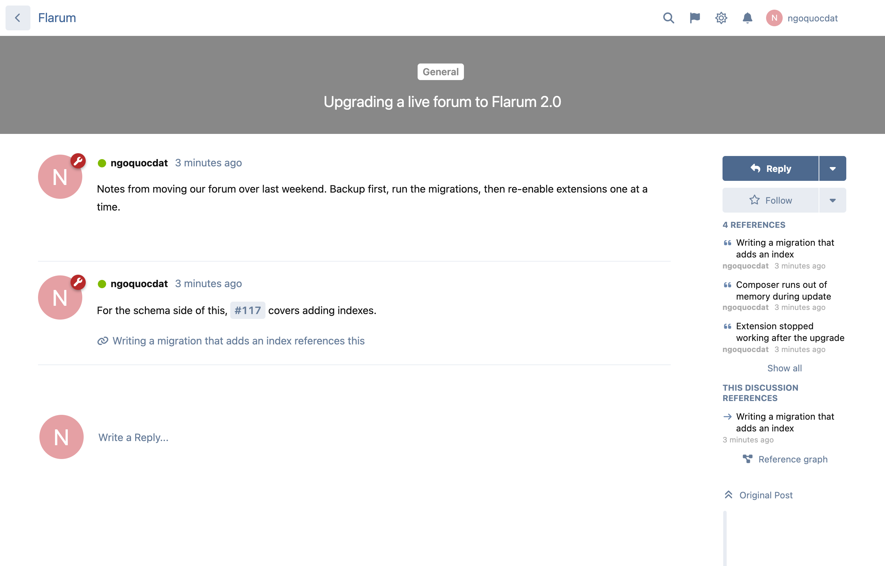
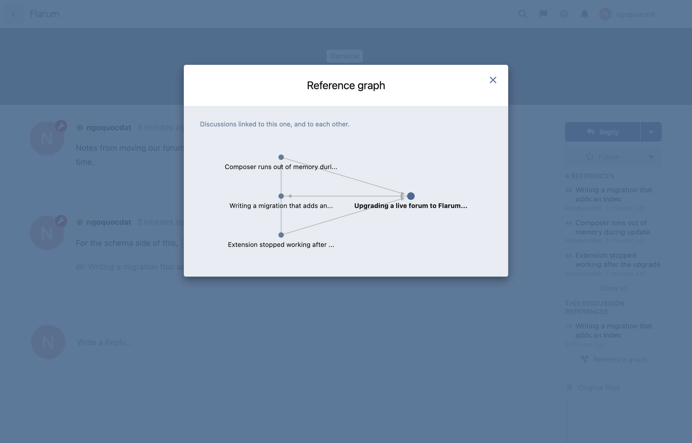
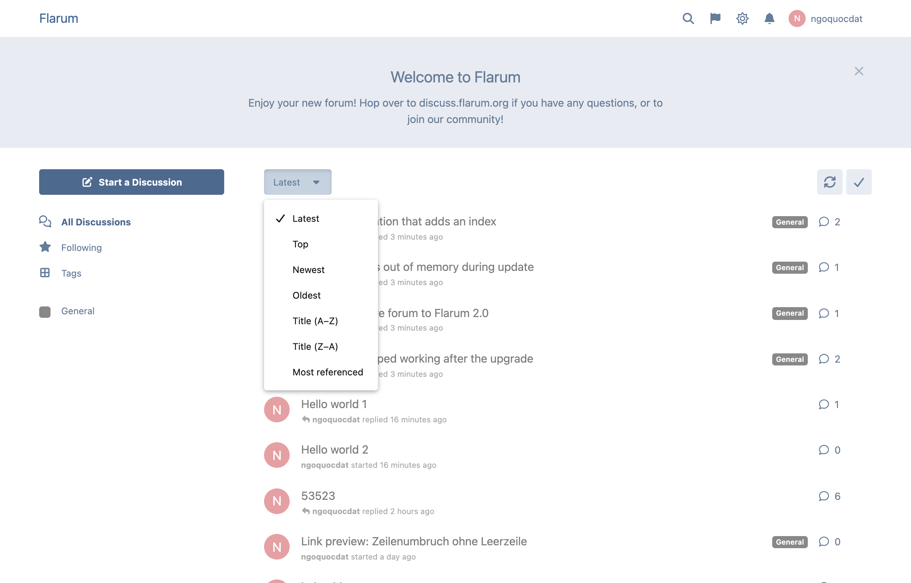
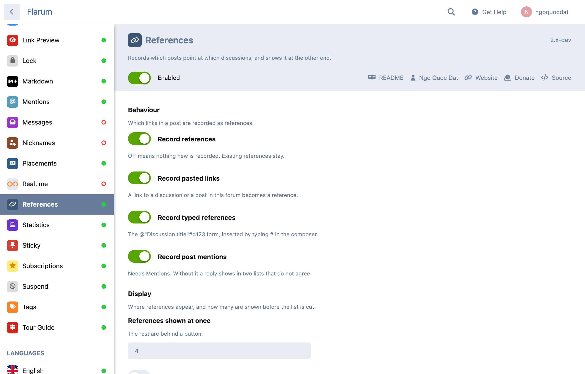

# References

[](LICENSE.md) [](https://packagist.org/packages/datlechin/flarum-references) [](https://packagist.org/packages/datlechin/flarum-references) [](https://github.com/sponsors/datlechin)

Someone links a discussion from another post. Flarum turns it into a `#12` label and records nothing, so the discussion being linked never finds out. This keeps the connection and shows it at both ends.



## Install

```sh
composer require datlechin/flarum-references
php flarum migrate
php flarum references:backfill
```

Needs Flarum 2.0 and PHP 8.2.

Run the backfill once. Posts written before you installed this are only picked up that way, because Flarum releases the events it listens to through the API layer alone.

## What gets recorded

- A link to a discussion or to a post in this forum.
- A typed reference. Press `#` in the composer, pick a discussion, and it inserts `@"Discussion title"#d12`. Edit the post later and you see it back with the title as it reads today.
- A post mention, when Mentions is installed.

Linking the same target twice in one post is one reference, not two.

## What you see

A discussion lists what points at it and what it points at. A post that was linked says so under its text, in the same place Mentions puts its replies, merged into one list instead of two that disagree.

Related discussions come from which discussions get cited together, not from tags or titles.

The graph shows how the discussions around this one connect.



The discussion list can be sorted by how often each one is cited.



Search with `references:12`, `referenced-by:12` and `has:references`.

## For moderators

A reference can be given a type: duplicate of, see also, supersedes, answers. Typing one protects it, so it survives an edit to the post that produced it.

You can also add a reference by hand between two discussions, without editing anybody's post.

When a target is deleted the reference is kept and marked broken, so the report has something to show. The admin page has counts by day, by origin and by relation, with CSV export.

## Settings

Admin, then Extensions, then References.



| Setting | Default | What it does |
| --- | --- | --- |
| Record references | on | Master switch. Off stops recording, existing references stay. |
| Record pasted links | on | A link to a discussion or a post here becomes a reference. |
| Record typed references | on | The `@"Title"#d12` form. |
| Record post mentions | on | Needs Mentions. |
| References shown at once | 4 | The rest go behind a button. |
| Announce references in the discussion | off | Adds a line saying where it was linked from. |
| Show related discussions | on | With how many to show, and a ceiling on how many discussions are read to find them. |
| Cache duration | 300s | For the related list and the graph. 0 turns caching off. |
| Graph depth | 2 | How many steps out the graph reaches, and how many links per step. |
| Also notify followers | on | Needs Subscriptions. |
| Keep broken references | 365 days | 0 keeps them forever. |

## Permissions

Three, so reading the reports does not carry the right to change anything.

| Permission | Allows |
| --- | --- |
| Create and edit references | Adding a reference by hand, and typing one. |
| See broken references | The broken report. |
| See reference analytics | The counts and the CSV export. |

## Notifications

The author of what was referenced hears about it, and followers of that discussion when Subscriptions is on. Alert by default, email opt-in, both in the usual notification settings.

A post mention that Mentions already announced is not announced twice.

## Commands

| Command | What it does |
| --- | --- |
| `references:backfill` | Records references for posts written before install. Resume with `--from-id`. |
| `references:reconcile` | Recomputes the ranking counter. Runs daily. |
| `references:build-daily-rollup` | Aggregates for the analytics page. Runs daily. |
| `references:purge-broken` | Drops broken references past the retention window. Runs daily. |

## For extension authors

A reference can point at something this extension has never heard of:

```php
(new Extend\Conditional())
    ->whenExtensionEnabled('datlechin-references', fn () => [
        (new \Datlechin\References\Extend\ReferenceTargets())
            ->add(WikiPageTarget::class),
    ]),
```

One `ReferenceTarget` covers URL extraction, the manual picker, the polymorphic `target` relationship, the morph map and the moderation UI. Read the interface first. A `query()` that forgets `whereVisibleTo` leaks the existence of things the reader cannot open, because counts run through a path that skips the resource's own scope.

## Links

- [Packagist](https://packagist.org/packages/datlechin/flarum-references)
- [Issues](https://github.com/datlechin/flarum-references/issues)
