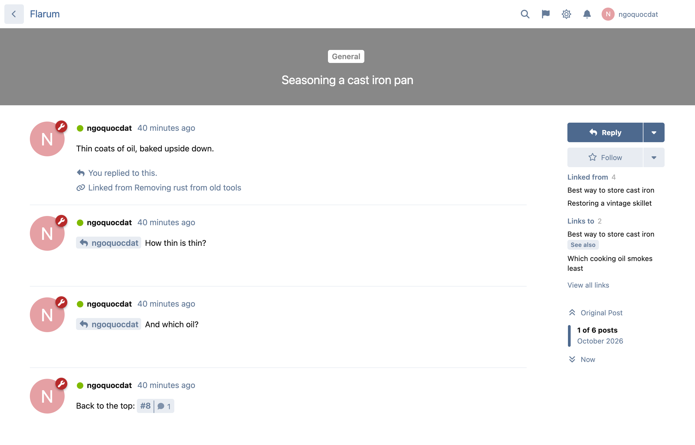
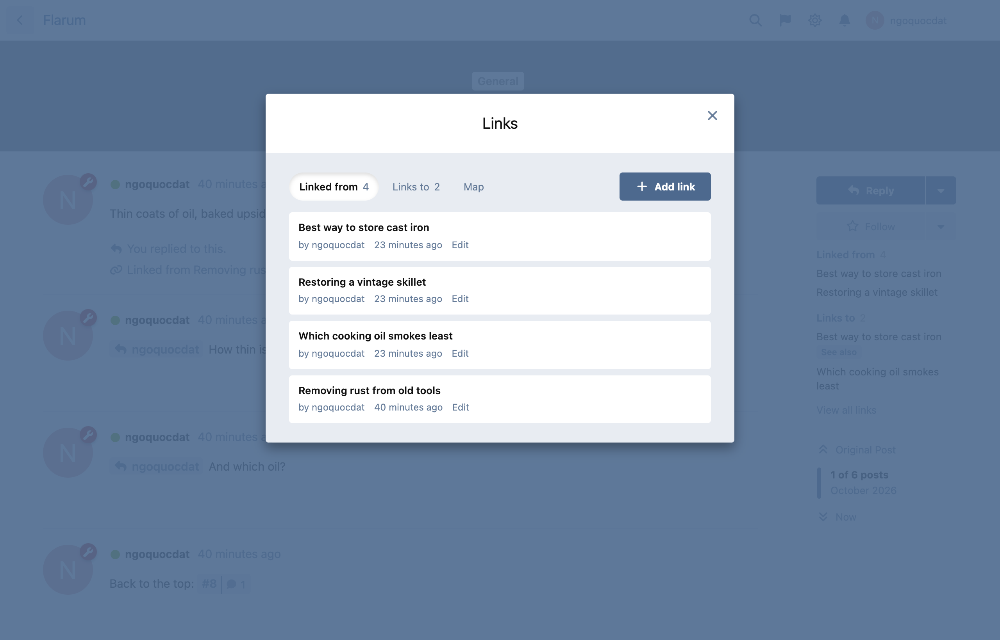
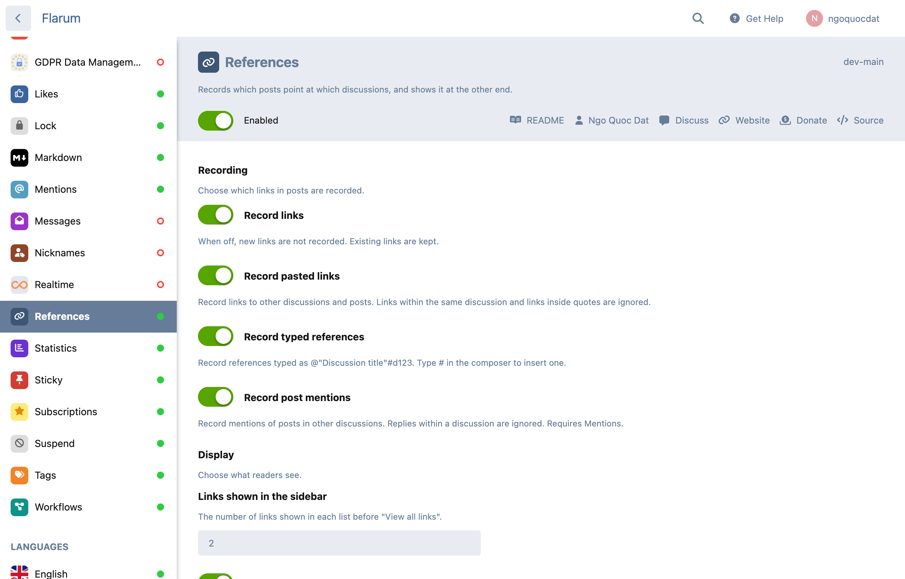

# References

[](LICENSE.md) [](https://packagist.org/packages/datlechin/flarum-references) [](https://packagist.org/packages/datlechin/flarum-references) [](https://github.com/sponsors/datlechin)

A [Flarum](https://flarum.org) extension that tracks links between discussions. When a post links to another discussion, the linked discussion shows where it was linked from.



## Features

- Records links to other discussions and to posts in other discussions.
- Adds a `#` picker to the composer that inserts a discussion reference: `@"Discussion title"#d12`.
- Shows "Linked from" and "Links to" lists in the discussion sidebar. On phones this is one "N links" button.
- Shows "Linked from ..." under a post that another discussion links to.
- An "All links" dialog with details and a map of connected discussions.
- Related discussions, based on which discussions are linked together.
- A "Most linked" sort option.
- Search filters: `references:12`, `referenced-by:12`, `has:references`.
- Moderators can add links by hand, set a type (duplicate of, see also, replaces, answers), add a note, and remove links they added.
- Notifications for authors and followers.
- Admin reports: broken links and analytics with CSV export.



## What counts as a link

A link from one discussion to a **different** discussion. These are not recorded:

- Replies and links within the same discussion. Mentions already shows replies.
- Links inside quotes. They belong to the quoted post.

Linking the same target more than once in a post counts once.

## Moderation

Open a discussion's moderation menu and choose **Manage links**. From there you can:

- **Add link**: link this discussion to another one without editing any post.
- **Edit**: set the link type and a note. An edited link is kept when its post is edited.
- **Remove**: delete a link that was added by hand. Links written in posts are removed by editing the post.

## Installation

Requires Flarum 2.0 and PHP 8.2.

```sh
composer require datlechin/flarum-references
php flarum migrate
php flarum cache:clear
php flarum references:backfill
```

The backfill command records references in posts written before the extension was installed. Run it once.

## Updating

```sh
composer update datlechin/flarum-references
php flarum migrate
php flarum cache:clear
```

## Settings

Go to **Admin → Extensions → References**.



| Setting | Default | Description |
| --- | --- | --- |
| Record links | On | Turns recording on or off. Existing links are kept. |
| Record pasted links | On | Record links to other discussions and posts. |
| Record typed references | On | Record `@"Title"#d12` references. |
| Record post mentions | On | Record mentions of posts in other discussions. Requires Mentions. |
| Links shown in the sidebar | 4 | How many links each sidebar list shows. |
| Announce new links in the discussion | Off | Adds an event post to the linked discussion. |
| Show related discussions | On | Shows related discussions in the sidebar. |
| Cache duration | 300 | Seconds to cache related discussions and the map. `0` disables caching. |
| Graph depth | 2 | How many steps the map follows. |
| Notify followers | On | Notify users following the linked discussion. Requires Subscriptions. |
| Keep broken references | 365 | Days to keep links to deleted content. `0` keeps them forever. |

## Permissions

| Permission | Default | Allows |
| --- | --- | --- |
| Create and edit references | Moderators | Adding, editing and removing links. |
| See broken references | Moderators | The broken references report. |
| See reference analytics | Admins | The analytics report and CSV export. |

## Notifications

Users can turn each type on or off in their notification settings.

- Someone links to a discussion you started.
- Someone links to your post.
- Someone links to a discussion you follow (requires Subscriptions).

Post mentions are announced by Mentions, so the post author is not notified twice.

## Commands

| Command | Description |
| --- | --- |
| `references:backfill` | Records references in existing posts. Use `--from-id` to resume. |
| `references:reconcile` | Recalculates the reference counts. Runs daily. |
| `references:build-daily-rollup` | Builds the analytics data. Runs daily. |
| `references:purge-broken` | Deletes broken references older than the retention period. Runs daily. |

Daily commands run through Flarum's scheduler (`php flarum schedule:run`).

## For developers

Register a new reference target, such as a wiki page:

```php
(new Extend\Conditional())
    ->whenExtensionEnabled('datlechin-references', fn () => [
        (new \Datlechin\References\Extend\ReferenceTargets())
            ->add(WikiPageTarget::class),
    ]),
```

`WikiPageTarget` implements `Datlechin\References\Contract\ReferenceTarget`. Its `query()` method must apply `whereVisibleTo($actor)`, otherwise reference counts can include items the user cannot see.

## Links

- [Discuss](https://discuss.flarum.org/d/39830-references)
- [Packagist](https://packagist.org/packages/datlechin/flarum-references)
- [GitHub](https://github.com/datlechin/flarum-references)
- [Issues](https://github.com/datlechin/flarum-references/issues)
